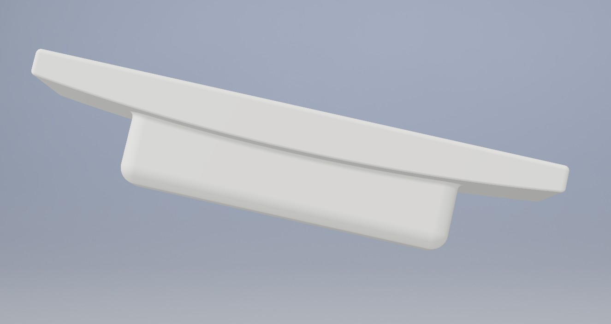

# The Sink Plug

A part that can be created on a 3D printer to block the sink overflow on a bathroom sink
for aesthetic purposes.  This will reduce but not completely stop the flow of water.

Edit the SinkPlug.ipt part file to create a similar part.  The SinkPlug.stl file
can be used to directly create the part on a 3D printer.

## Rendered 3D View

## Built With

* Autodesk Inventor

## Contributing

Please contact the author to contribute or to suggest modified versions if you want your own sink plug.

## Authors

* **Nicholas J. Kinar** - *Initial work* - 3D model

## License

This project is licensed under the MIT License - see the [LICENSE.md](LICENSE.md) file for details

## Acknowledgments

* Autodesk for the Inventor Professional software license for Education
* Full Deck Visuals (Saskatoon, Saskatchewan, Canada) for the sink plug image
